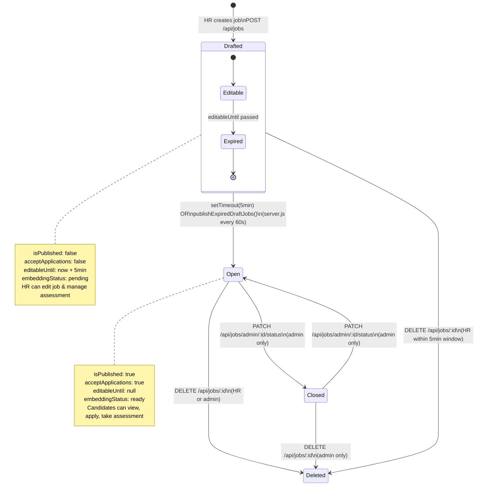
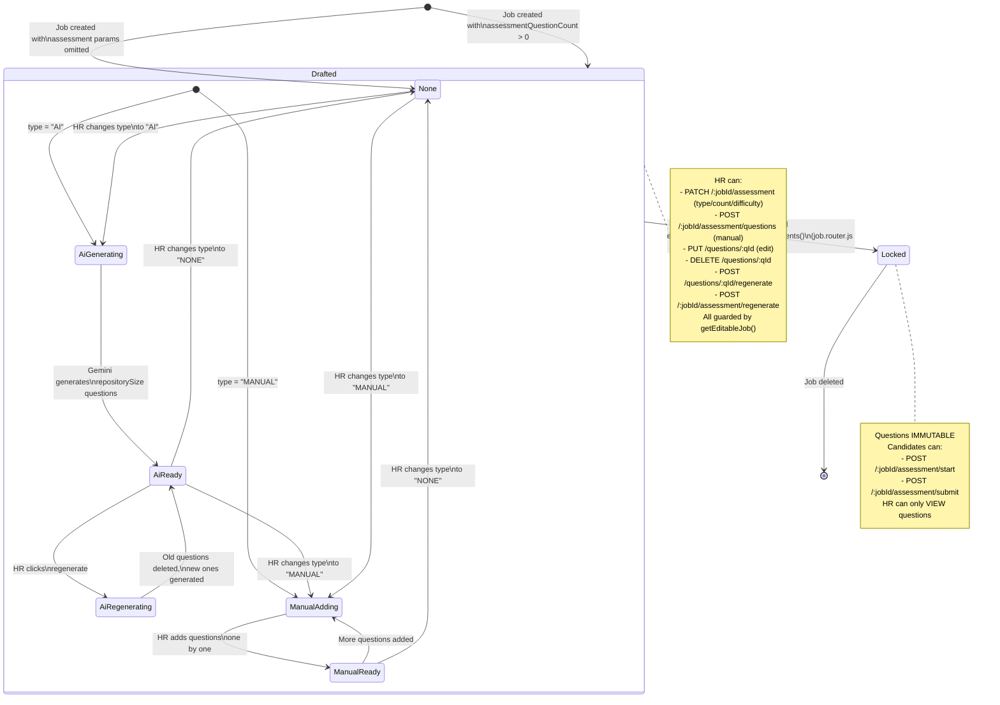
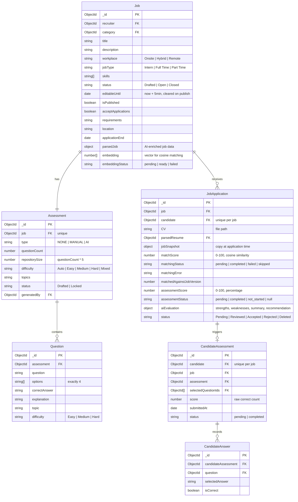
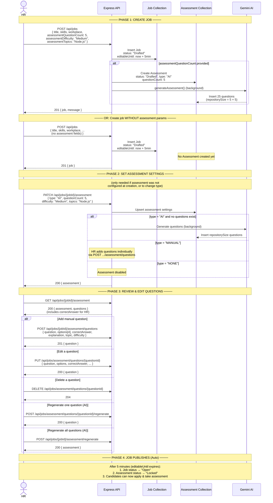

# Job & Assessment Flow Diagrams

## 1. JOB STATUS STATE MACHINE

---

## 2. ASSESSMENT STATUS STATE MACHINE

---

## 3. COMPLETE CANDIDATE FLOW (Apply → Assessment)

```mermaid
flowchart TB
    %% Registration
    A["Candidate Register/Login\nPOST /api/auth/register or /login"] --> B["Browse Jobs\nGET /api/jobs"]

    %% Apply
    B --> C["Apply to Job\nPOST /api/jobs/{jobId}/apply\nForm-data: CV (pdf/docx)"]
    C --> D["JobApplication Created\nstatus: Pending\nmatchingStatus: pending\nassessmentStatus: null\nmatchScore: null\nassessmentScore: null"]

    %% Background matching
    D --> E{"Background:\ncalculateApplicationMatch()"}
    E --> F["1. Parse CV via AI → parsedResume"]
    F --> G["2. Generate resume embedding"]
    G --> H["3. Cosine similarity\njobEmbedding ↔ resumeEmbedding\n→ value in [-1, 1]"]
    H --> I["4. Convert to matchScore\nround(((sim+1)/2)*10000)/100\n→ value in [0.00, 100.00]"]
    I --> J["5. Save to JobApplication\nmatchingStatus: completed"]

    %% Check assessment availability
    J --> K{"Job has active\nassessment?"}

    K -- No --> L["✅ Flow ends here\nCandidate can view\napplication status"]

    K -- Yes --> M["Start Assessment\nPOST /api/jobs/{jobId}/assessment/start"]

    %% Guards
    M --> M1{"Guards"}
    M1 --> M2["job.status === 'Open'?"]
    M1 --> M3["assessment.status === 'Locked'?"]
    M1 --> M4["No existing completed\nCandidateAssessment?"]
    M2 -- No --> ERR1["403: Job not open"]
    M3 -- No --> ERR2["404: No active assessment"]
    M4 -- No --> M5["Return existing score\n(already completed)"]

    %% Question selection
    M2 -- Yes --> M6
    M3 -- Yes --> M6
    M4 -- Yes --> M6

    M6["Random question selection\nshuffle(allQuestions)\n.slice(0, questionCount)"]
    M6 --> M7["Create CandidateAssessment\nstatus: pending\nselectedQuestionIds: [...]"]
    M7 --> M8["Return questions to candidate\nWITHOUT correctAnswer"]
    M8 --> M9["Display:\nquestion + options[4]\n(candidate answers)"]

    %% Submit
    M9 --> N["Submit Assessment\nPOST /api/jobs/{jobId}/assessment/submit\nBody: { answers: [{questionId, selectedAnswer}] }"]

    %% Scoring
    N --> O["For each answer:"]
    O --> P{"answer.selectedAnswer ===\nquestion.correctAnswer?"}
    P -- Yes --> Q["isCorrect = true\nscore++"]
    P -- No --> R["isCorrect = false"]
    Q --> S["Save CandidateAnswer\n{ question, selectedAnswer, isCorrect }"]
    R --> S
    S --> T["All answers processed?"]
    T -- No --> O
    T -- Yes --> U["Update CandidateAssessment\nscore: raw count\nsubmittedAt: now\nstatus: completed"]

    U --> V["Calculate percentage\nround(score/total * 100)"]
    V --> W["Update JobApplication\nassessmentScore: percentage\nassessmentStatus: completed"]
    W --> X["Return result\n{ score, total, percentage }"]

    %% Styling - application lifecycle
    style D fill:#e1f5fe,stroke:#0288d1
    style J fill:#e1f5fe,stroke:#0288d1
    style W fill:#e1f5fe,stroke:#0288d1

    %% Styling - background process
    style E fill:#fff3e0,stroke:#f57c00
    style F fill:#fff3e0,stroke:#f57c00
    style G fill:#fff3e0,stroke:#f57c00
    style H fill:#fff3e0,stroke:#f57c00
    style I fill:#fff3e0,stroke:#f57c00
    style J fill:#fff3e0,stroke:#f57c00

    %% Styling - assessment flow
    style M6 fill:#e8f5e9,stroke:#388e3c
    style M7 fill:#e8f5e9,stroke:#388e3c
    style M8 fill:#e8f5e9,stroke:#388e3c
    style N fill:#e8f5e9,stroke:#388e3c
    style X fill:#e8f5e9,stroke:#388e3c

    %% Styling - errors
    style ERR1 fill:#ffebee,stroke:#d32f2f
    style ERR2 fill:#ffebee,stroke:#d32f2f
```

---

## 4. DATA RELATIONSHIPS (Model Links)

---

## Key Design Decisions

| Decision | Rationale |
|---|---|
| **repositorySize = questionCount × 5** | Each candidate gets a different random subset, preventing answer sharing |
| **correctAnswer hidden from candidates** | Prevents cheating; HR still sees it during draft review |
| **5-min draft window** | Gives HR time to review/edit before auto-publishing |
| **Dual publish mechanism** | `setTimeout` per job (primary) + `setInterval` every 60s (fallback after restart) |
| **scores stripped at API layer** | `sanitizeApplicationForCandidate()` removes matchScore/assessmentScore/aiEvaluation before JSON serialization |
| **applications sorted by matchScore desc → assessmentScore desc → createdAt asc** | HR sees best candidates first |
| **workplace**: Onsite, Hybrid, Remote | — |
| **jobType**: Intern, Full Time, Part Time | — |
| **difficulty**: Auto, Easy, Medium, Hard, Mixed | — |

---

## 5. HR FLOW (Create Job + Configure Assessment)

### Endpoint Reference

| Phase | Method | Endpoint | Purpose | Auth | Body |
|---|---|---|---|---|---|
| **1** | `POST` | `/api/jobs` | Create job + optional assessment config | HR | `{ title, skills, ..., assessmentQuestionCount?, assessmentDifficulty?, assessmentTopics? }` |
| **2** | `PATCH` | `/api/jobs/{jobId}/assessment` | Set/change assessment type & settings | HR | `{ type?, questionCount?, difficulty?, topics? }` |
| **3a** | `GET` | `/api/jobs/{jobId}/assessment` | View assessment + questions (with answers) | HR | — |
| **3b** | `POST` | `/api/jobs/{jobId}/assessment/questions` | Add one manual question | HR | `{ question, options[4], correctAnswer, explanation, topic, difficulty }` |
| **3c** | `PUT` | `/api/jobs/assessment/questions/{questionId}` | Edit a question | HR | `{ question?, options?, correctAnswer?, ... }` |
| **3d** | `DELETE` | `/api/jobs/assessment/questions/{questionId}` | Delete a question | HR | — |
| **3e** | `POST` | `/api/jobs/assessment/questions/{questionId}/regenerate` | AI-regenerate one question | HR | — |
| **3f** | `POST` | `/api/jobs/{jobId}/assessment/regenerate` | AI-regenerate ALL questions | HR | — |
| **4** | *(auto)* | Background worker (every 60s) | Publish job + lock assessment | — | — |

### Key Points

1. **Set assessment at creation** — include `assessmentQuestionCount` in `POST /api/jobs`. Assessment auto-generates with `type: "AI"`. No separate PATCH needed.
2. **OR create job without assessment** — leave out `assessmentQuestionCount`. Use `PATCH /api/jobs/{jobId}/assessment` to configure later.
3. **`PATCH` can change type** — switch AI ↔ MANUAL ↔ NONE during the 5-min draft window.
4. **All Phase 3** only works while assessment is `"Drafted"`. Once locked (5 min), questions are immutable.
5. **No explicit HR publish** — publishing is automatic after 5 min. Admin can override via `PATCH /api/jobs/admin/{jobId}/status`.
